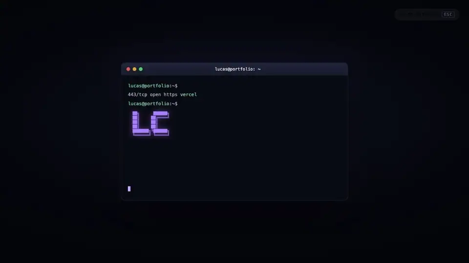
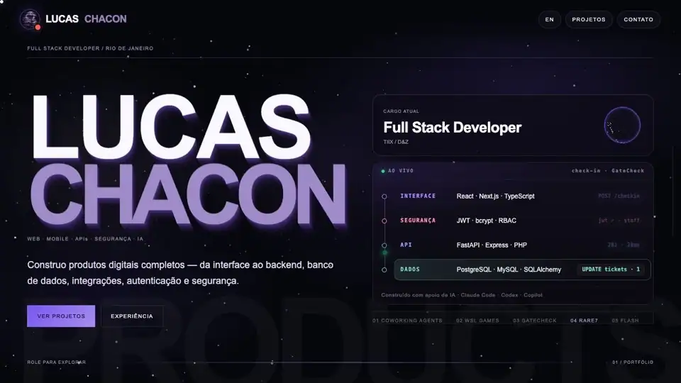
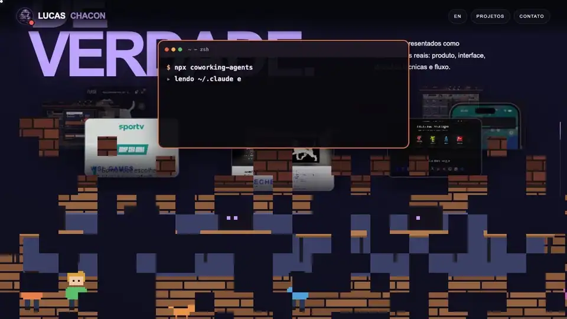
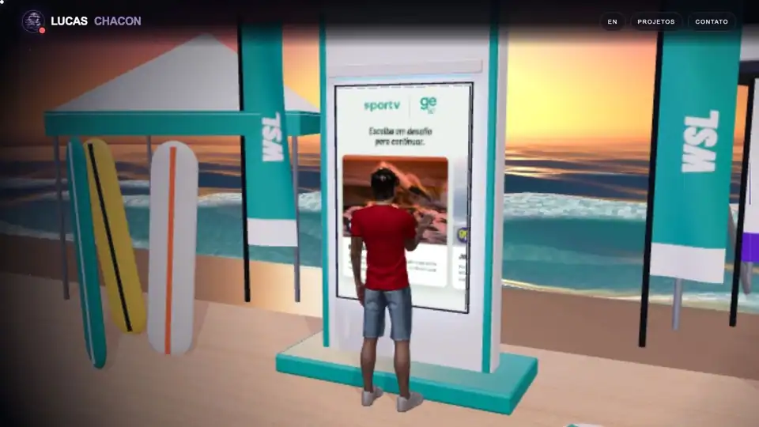
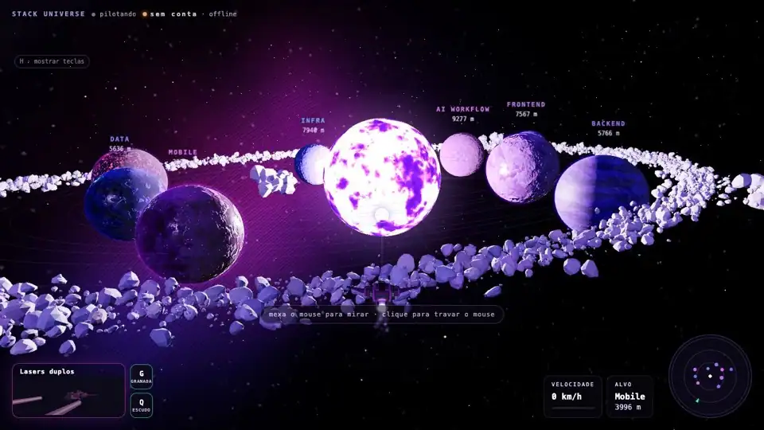
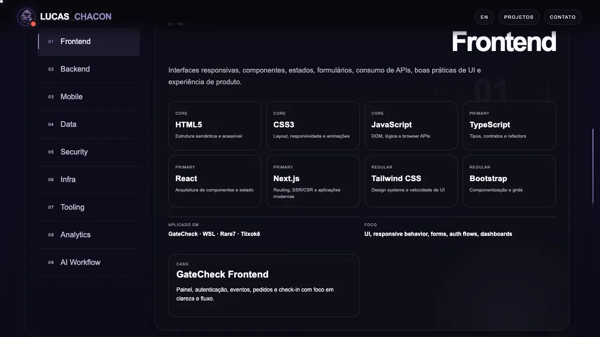
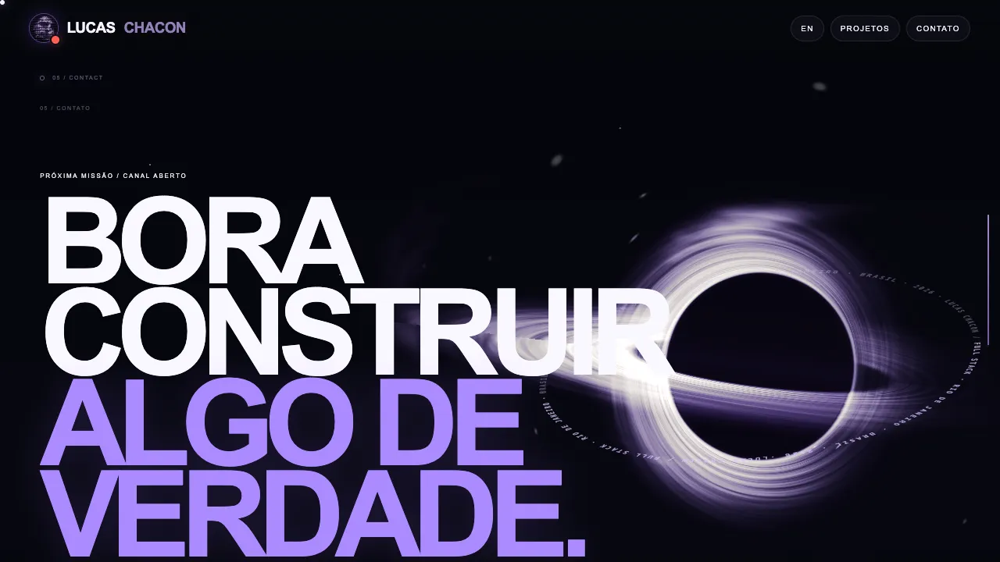
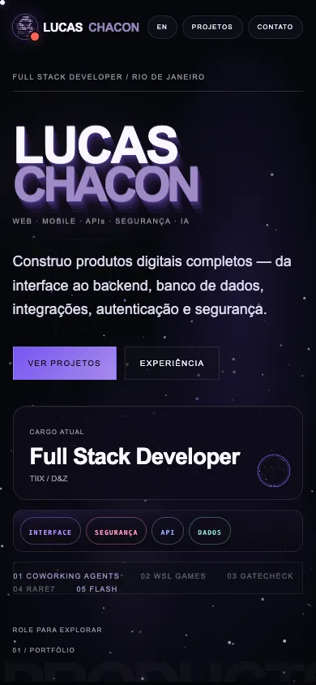

<h1 align="center">Lucas Chacon — Portfólio</h1>

<p align="center"><b>Desenvolvedor full stack. Um portfólio que é uma experiência: universo 3D, projetos em cena e um jogo de nave online.</b></p>

<p align="center">
  
  
  
  
  
</p>

<p align="center">
  <a href="https://portfolio-delta-five-78.vercel.app"><b>▶ Ver ao vivo</b></a> ·
  <a href="#o-universo-das-stacks">Universo 3D</a> ·
  <a href="#projetos-em-cena">Projetos</a> ·
  <a href="#stack-universe-o-jogo">O jogo</a> ·
  <a href="#rodar-localmente">Rodar localmente</a>
</p>

<p align="center"></p>

## O universo das stacks

<p align="center"></p>

A câmera atravessa o **"O" de CHACON** e entra num sistema solar em Three.js: cada planeta é uma área (frontend, backend, mobile, dados, segurança, infra, tooling, analytics, workflow com IA). Clique num planeta e ele abre as tecnologias daquela área, com o nível de cada uma e os projetos em que ela foi usada.

## Projetos em cena

Cada projeto é um capítulo com cena 3D própria. A câmera sai de um plano geral do ambiente e entra até a tela do produto, onde passam as capturas reais conforme você rola. Entre um capítulo e outro, uma vinheta com a cara do projeto.

<p align="center"></p>

<p align="center"></p>

| | Projeto | O que é |
|---|---|---|
| 01 | **[Coworking Agents](https://github.com/ChaconLucas/coworking-agents)** | Escritório em pixel art para agentes de IA: cada sessão do Claude Code ou do Codex vira uma pessoa numa mesa. No capítulo, o monitor 3D mostra o escritório **rodando ao vivo**, e o botão ▶ abre a [demo](https://portfolio-delta-five-78.vercel.app/demos/coworking/index.html) para mexer, sem servidor e sem gastar tokens. |
| 02 | **WSL Games** | Experiência touch de evento para o campeonato mundial de surfe: quiz, julgamento de onda e resultado no celular por QR Code. [Demo ao vivo](https://wsl-sportv-games.vercel.app). |
| 03 | **GateCheck** | Plataforma de eventos: venda de ingressos por lote, QR Code individual e check-in em tempo real com auditoria. |
| 04 | **Rare7** | E-commerce de camisas de futebol: catálogo por liga e clube, produto, checkout com Mercado Pago e administração. |
| 05 | **FLASH** | Marketplace de materiais para tatuagem com entrega por motoboy: web, API e aplicativo com as mesmas regras. |

## Stack Universe: o jogo

<p align="center"></p>

Pelo botão **Pilotar** (ou o comando `pilotar` no terminal do avatar, no topo), o universo das stacks vira um jogo:

- nave com cabine, dobra espacial e quatro armas; os asteroides do cinturão podem ser destruídos;
- pouso nos planetas, com entrada pela atmosfera, e exploração **a pé**, em primeira e em terceira pessoa (armas, sabre de luz, granada, jetpack);
- **multiplayer online** com conta, PvP e voz, num servidor em Cloudflare Workers (PartyServer);
- controles de toque no celular, mapa e ajustes de campo de visão no menu de pausa.

## E mais

| Arquivo técnico | Contato | Celular |
|---|---|---|
|  |  |  |

- **Bilíngue:** português e inglês, com troca na hora pelo botão do topo.
- **Avatar em ASCII com terminal:** comandos `help`, `whoami`, `stack`, `projetos`, `contato`, `cv`, `criar-conta`, `pilotar`…
- **Desempenho:** cada cena 3D só é montada perto da tela e desmontada ao sair, e a resolução cai sozinha em máquina mais fraca.
- **Movimento reduzido:** respeita `prefers-reduced-motion`.

## Como foi feito

- **Front-end:** HTML, CSS e JavaScript em módulos, sem framework, empacotados com **Vite**.
- **3D:** **Three.js r180** com shaders próprios (estrelas, atmosfera, véus, pixels), modelos GLTF/FBX e personagens com esqueleto e animação.
- **Online:** **Cloudflare Workers + PartyServer** (contas, salas, posição dos jogadores, PvP e voz), em `party/` e `wrangler.jsonc`.
- **Deploy:** **Vercel**, a cada push no `main`.
- Desenvolvido com **Claude Code** e **OpenAI Codex** no fluxo de implementação e revisão.

## Rodar localmente

```bash
npm install
npm run dev
```

Abra a URL mostrada pelo Vite. Não abra `index.html` direto por `file://`, porque o projeto usa ES modules.

```bash
npm run build
npm run preview
```

### Documentação (ordem de leitura para IA)

1. `docs/HANDOFF.md`
2. `docs/ARCHITECTURE.md`
3. `docs/MOTION_SYSTEM.md`
4. `docs/DESIGN_SYSTEM.md`
5. `docs/KNOWN_ISSUES.md`
6. `docs/INTRO_ANIMATION.md`

**Regra principal:** o universo 3D atual é **baseline aprovado**. Não substituí-lo por Canvas 2D, iframe, vídeo ou imagem estática. Evoluções devem preservar interação, profundidade, shaders, iluminação, labels clicáveis e o comportamento de scroll.

<sub>As animações deste README são gravações do próprio site (`docs/midia/`).</sub>
